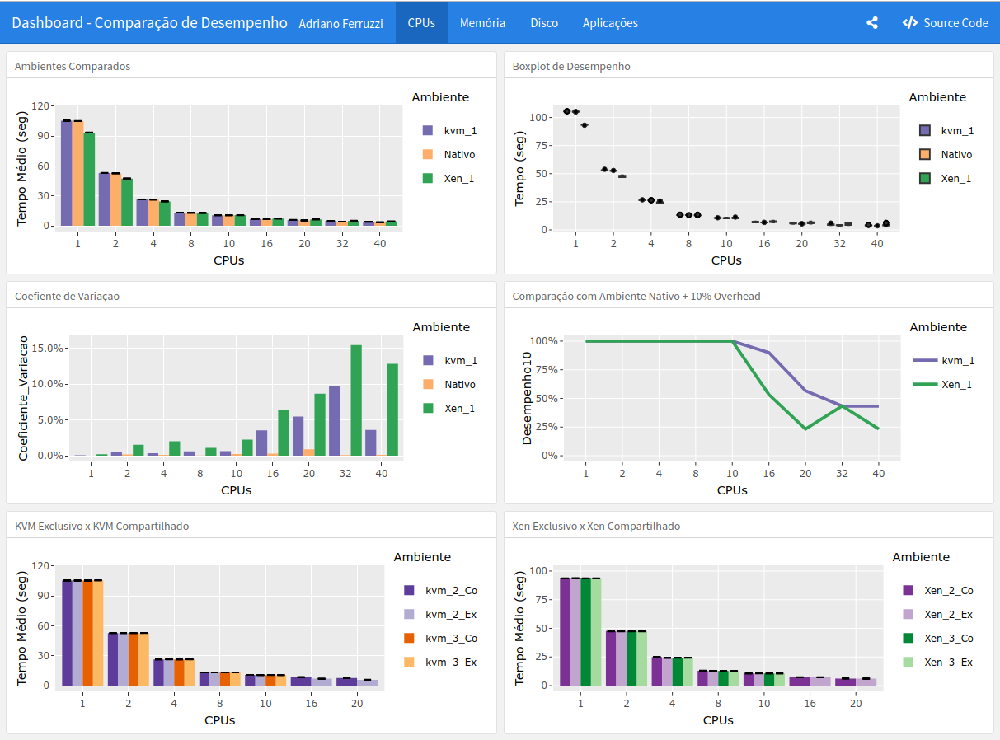

# vmdata - Projeto de Defesa de Mestrado

<h2> Análise do Comportamento de Aplicações Paralelas em Ambientes de Computação de Alto Desempenho Virtualizados </h2>

Scripts, dados e gráficos criados a partir da análise dos benchmarks realizados neste trabalho.
Para a realização dos benchmarks foram utilizados os softwares sysbench, dd e hdparm, cujo objetivo foi gerar uma medição de CPU, memória RAM e leitura/escrita de disco. 
O hardware utilizado para a montagem dos ambientes possui a seguinte configuração: 2 processadores Intel Xeon E5-2670 v2 de 2.50GHz de 40 threads com Hyperthreading, 64 GB de memória RAM DDR4 2133 MHz (8 x 8 GB), 1 disco SATA 1000 GB 7200 RPM e conexão de rede Gigabit Ethernet. Além de ser configurado com sistema operacional Suse Linux Enterprise Server 12.1 em todos os ambientes.
Todos os benchmarks foram executados 30 vezes, em seguida, calculado a média de desempenho, o intervalo de confiança de 95% visando garantir a confiabilidade dos dados, além de outras medidas que pode ser vistas nos scripts e na tese. 
Os ambientes virtuais foram implementados com as seguintes configurações: 
  1 - vm-1 : 40 threads, 50GB de memória e 100GB de disco;  
  2 - vm-2 : 20 threads, 30GB de memória e 100GB de disco;  
  3 - vm-3 : 10 threads, 15GB de memória e 100GB de disco.  

O software R foi utilizado para a análise dos resultados de desempenho, assim como, para a criação dos gráficos. Os arquivos utilizados no projeto estão dispostos nos seguintes diretórios: 

 <b> ScriptsR/ </b> - Scripts R utilizados no trabalho;  
 <b> Imagens/ </b> - Imagens utilizadas no trabalho;  
 <b> Tabelas/ </b> - Tabelas com os dados obtidos nos benchmarks;  
 <b> Graficos/ </b> - Gráficos gerados a partir dos scripts e dos dados obtidos.  
 <b> Dashboard/ </b> - Dashboard com os gráficos gerados.  

  
